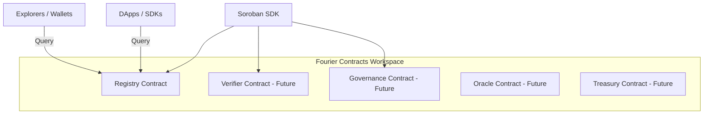

# Fourier Contracts System Architecture

This document describes the high-level architecture of the smart contracts powering the Fourier ecosystem.

## Vision
Fourier Contracts provides a decentralized, immutable on-chain source of truth for contract reputation, audit profiles, and safety records. While threat intelligence, exploit detection, and vulnerability scanning are executed off-chain by the Fourier intelligence layer, the smart contracts store and serve verified trust ratings to the wider Stellar/Soroban ecosystem.

## Modular Workspace Design
To prevent monolithic centralization and allow the protocol to grow over time, the repository is designed as a Cargo workspace. Each smart contract is isolated in the `contracts/` directory:

### Component Roles

- **Registry Contract (`contracts/registry`)**: The canonical storage layer containing verified contract reputation profiles. This is the first contract in the ecosystem and serves as the database.
- **Verifier Contract (Future)**: Will manage off-chain report verification logic, validator signatures, and oracle aggregation.
- **Governance Contract (Future)**: Will manage the administration rights, upgrades, parameter configuration, and ownership handover via DAO or multisig mechanisms.
- **Oracle Contract (Future)**: Will enable automated trust updates pushed by decentralized oracle networks.
- **Treasury & Rewards (Future)**: Will manage staking, rewards, and slashable incentives for reporters and verifiers.

## Architectural Principles

1. **Separation of Concerns**:
   - Business logic is divided into small, independent Rust modules (`storage.rs`, `validation.rs`, `access_control.rs`, etc.).
   - `lib.rs` is kept lightweight, acting solely as the public API dispatcher.

2. **Upgrade & Evolution Path**:
   - The contract admin is not a permanent hardcoded owner. Access control is built around address verification, enabling future seamless transfer to a DAO or governance contract.
   - Storage types and records include a `version` schema tag to permit easy data structure migrations in future upgrades.

3. **Query Optimization**:
   - Blockchains do not support efficient data table iteration. To solve this, we maintain a secondary index layout (`Index -> Address` and `Address -> Index`) allowing clients to perform O(1) paginated scanning of registry records without traversing all keys.
