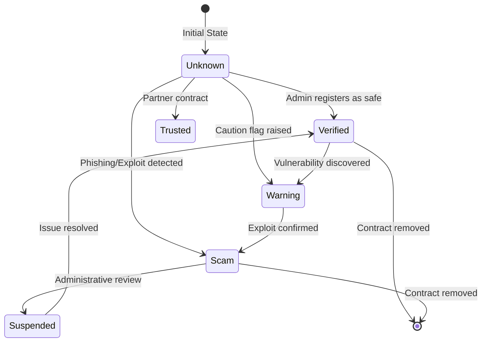

# Fourier Contracts Protocol Specification

This document details the interface definitions, state machine rules, and integration guidelines for the Fourier Contracts protocol.

## Public Interface

The `RegistryContract` implements the following public endpoints:

### 1. `initialize(env: Env, admin: Address)`
- **Role**: Configures the initial contract administrator.
- **Rules**: Can only be called once. Returns `AlreadyExists` if the admin is already set.

### 2. `register_contract(env: Env, contract: Address, status: ReputationStatus, risk_level: RiskLevel, risk_score: u32, reporter: Address, evidence_hash: BytesN<32>)`
- **Role**: Creates a new reputation profile.
- **Authorization**: Admin signature required.
- **Validation**:
  - `risk_score` must be between `0` and `100` inclusive.
  - `contract` address must not be equal to `reporter` address (preventing self-reporting).
- **Events**: Emits `ContractRegistered`. If the status is `Verified` or `Trusted`, also emits `ContractVerified`.

### 3. `update_reputation(env: Env, contract: Address, status: ReputationStatus, risk_level: RiskLevel, risk_score: u32, reporter: Address, evidence_hash: BytesN<32>)`
- **Role**: Modifies an existing contract's reputation.
- **Authorization**: Admin signature required.
- **Validation**: Same as registration. Record must exist.
- **State Changes**: Increments the record `version` by 1 and updates the `last_updated` timestamp.
- **Events**: Emits `ReputationUpdated`. If the status changes to `Verified` or `Trusted`, also emits `ContractVerified`.

### 4. `get_reputation(env: Env, contract: Address) -> Option<ContractRecord>`
- **Role**: Public query to retrieve the complete reputation profile of a contract.
- **TTL Management**: Automatically extends the TTL of the matching persistent storage key to ensure data remains live.

### 5. `is_verified(env: Env, contract: Address) -> bool`
- **Role**: Helper query for other smart contracts, wallets, or extensions to quickly verify if a contract is safe.
- **Rule**: Returns `true` if the contract status is `Verified` or `Trusted`. Returns `false` otherwise.

### 6. `remove_contract(env: Env, contract: Address)`
- **Role**: Deletes a contract record and cleans up the paginated index.
- **Authorization**: Admin signature required.
- **Events**: Emits `ContractRemoved`.

### 7. `list_contracts(env: Env, offset: u32, limit: u32) -> Vec<ContractRecord>`
- **Role**: Paginated query to list all contract reputation records.
- **Parameters**:
  - `offset`: Index to start reading from.
  - `limit`: Number of records to read.

### 8. `version(env: Env) -> String`
- **Role**: Returns the contract version (e.g. `"0.1.0"`).

---

## State Transition Rules

The following diagram outlines the reputation states a contract address can transition through:

